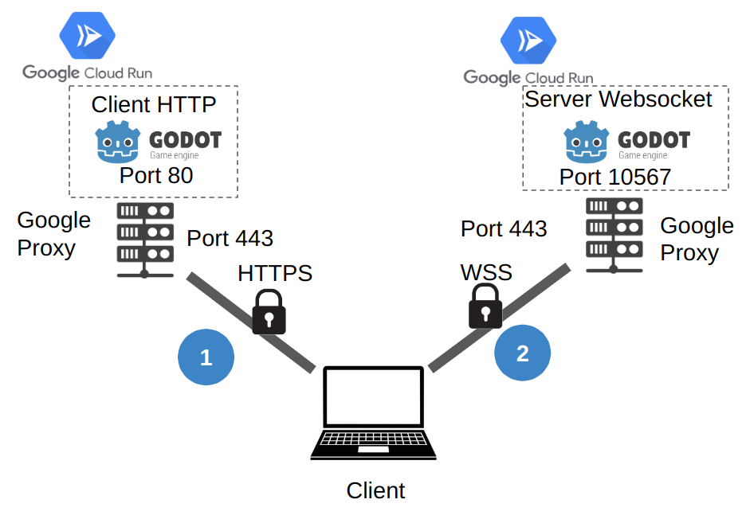
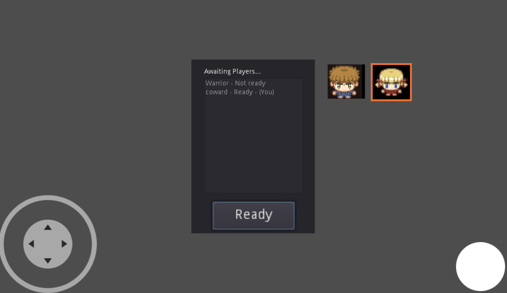

# Multiplayer Bomber

A multiplayer implementation of the classical bomberman game developped using Godot 3.5.  
This project is multiplayer using Websocket to connect the clients to the server.   
The client is served via a web server hosted in GCP (Cloud Run), thus the game is playable on web browser on all platforms (PC, mobile, tablet).  
The server is a linux based server listening to a WebSocket also hosted on GCP.  
This is a further iteration of the demo project and can be used as a base to implement a similar architecture project.

Link to the web-based client:  
[https://multiplayer-bomberman-hwyxubwqlq-ew.a.run.app/](https://multiplayer-bomberman-hwyxubwqlq-ew.a.run.app/)

Architecture of the solution: 

Language: GDScript

Renderer: GLES 2

## Screenshots

A system of lobby has also been implemented: 

